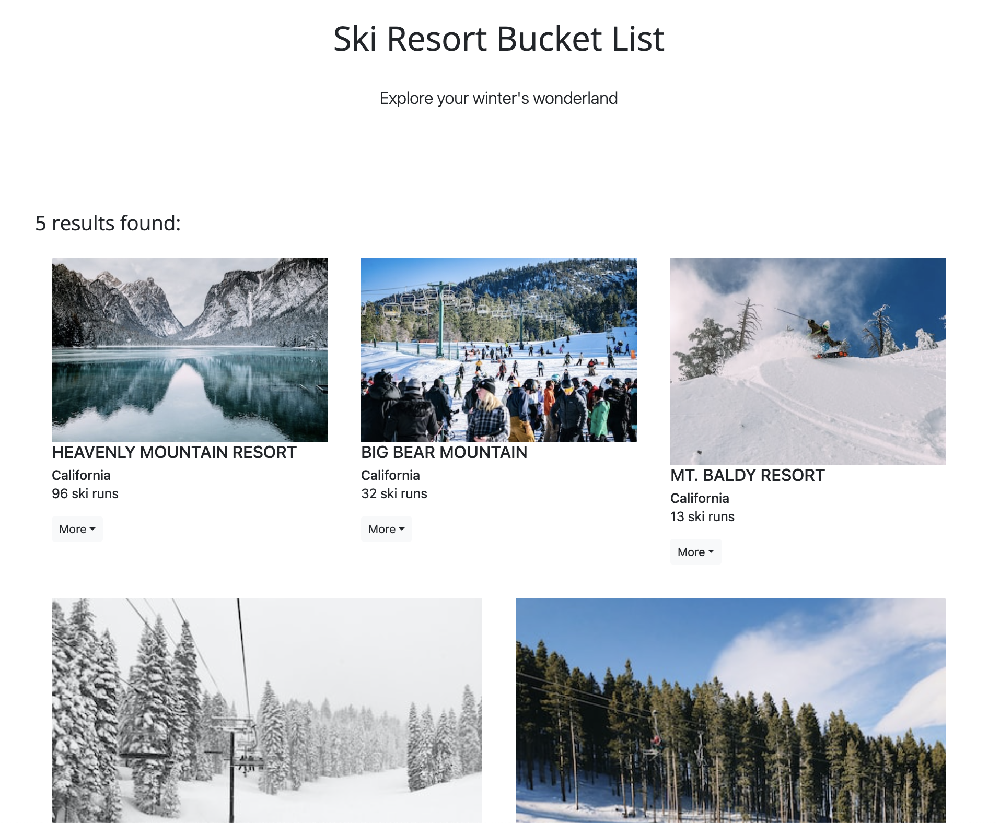

# SnowSeekers :snowboarder:



SnowSeekers is dedicated to helping you plan and keep track of all the amazing ski resorts you want to visit. Whether you're a seasoned skier or a beginner, there's always a new mountain to explore and new trails to conquer. With our easy-to-use interface, you can add new ski resorts to your list, view detailed information about each one, and even keep track of the resorts you've already visited. So grab your skis, pack your bags, and get ready to check off some incredible ski resorts from your bucket list!

### Deploy it
#### GitLab pages URL

https://kristenjin811.gitlab.io/snowseekers


## Features

* [ ] Display a list of ski resorts, each with the following information: name, location, and number of ski runs.
* [ ] Allow users to add a new ski resort to the list by filling out a form that includes the name, location, and number of ski runs.
* [ ] Allow users to edit the information for an existing ski resort.
* [ ] Allow users to delete a ski resort from the list.
* [ ] Grab ski resort image from Unsplash API and use as the resort's cover image in the list
* [ ] Add new photo of resort through webcam and use as cover image

## Project layout

This project is built only on the frontend.

## External API
Unsplash API is used to automatically updates the image with a ski resort form submission.
API key should is store in .env file.
#### Sample Unsplash API response
```
{
  "total": ???,
  "total_pages": ???,
  "results": [
    {
      "id": "???",
      "created_at": "2014-11-18T14:35:36-05:00",
      "width": 4000,
      "height": 3000,
      "color": "#A7A2A1",
      "likes": 286,
      "user": {
        "id": "???",
        "username": "???",
        "name": "???",
        "first_name": "???",
        "last_name": "???",
        "portfolio_url": "???",
        "profile_image": {
          "small": "https://images.unsplash.com/profile-f7caec08b5a41",
          "medium": "https://images.unsplash.com/profile-1g&crop=faces&cs",
          "large": "https://images.unsplash.com/profile-1&fm=jp8&w=128&s=32085a077"
        },
        "links": {
          "self": "https://api.unsplash.com/users/ugmonk",
          "html": "http://unsplash.com/@ugmonk",
          "photos": "https://api.unsplash.com/users/ugmonk/photos",
          "likes": "https://api.unsplash.com/users/ugmonk/likes"
        }
      },
      "urls": {
        "raw": "https://images.unsplash.com/photo-1416339306562-f3d12fefd36f",
        "full": "https://hd.unsplash.com/photo-1416339306562-f3d12fefd36f",
        "regular": "https://images.unsplash.com/photo-1416339306562-f3d12fefd",
        "small": "https://images.unsplash.com/photo-1416339306562-f3d12fefd36f",
        "thumb": "https://images.unsplash.com/photo-1416339306562-f3d12fefd36f"
      },
      "links": {
        "self": "https://api.unsplash.com/photos/eOLpJytrbsQ",
        "html": "http://unsplash.com/photos/eOLpJytrbsQ",
        "download": "http://unsplash.com/photos/eOLpJytrbsQ/download"
      }
    }
  ]
}
```

## Webcam Access
Webcam access is implemented with react-webcam

install react-webcam
```npm i react-webcam```

The webcam feature locates in editing ski resort form.
